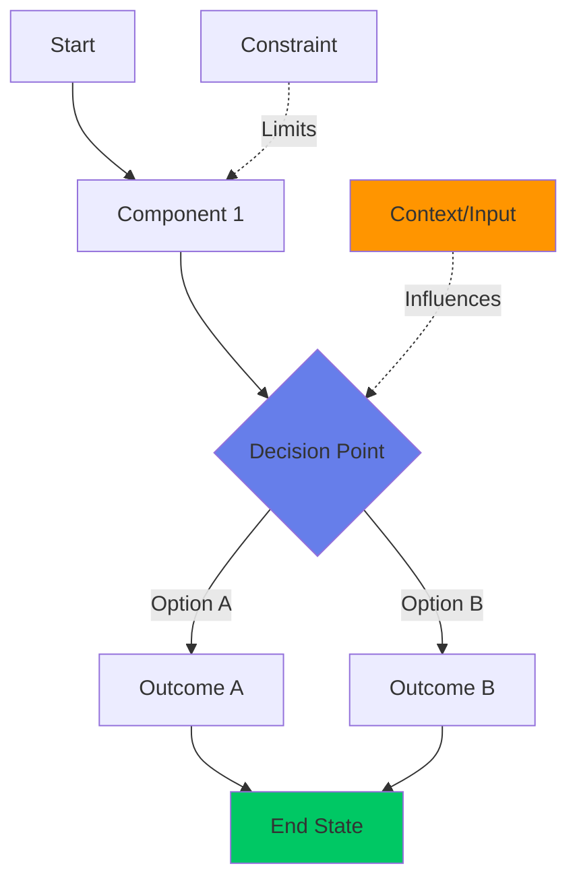
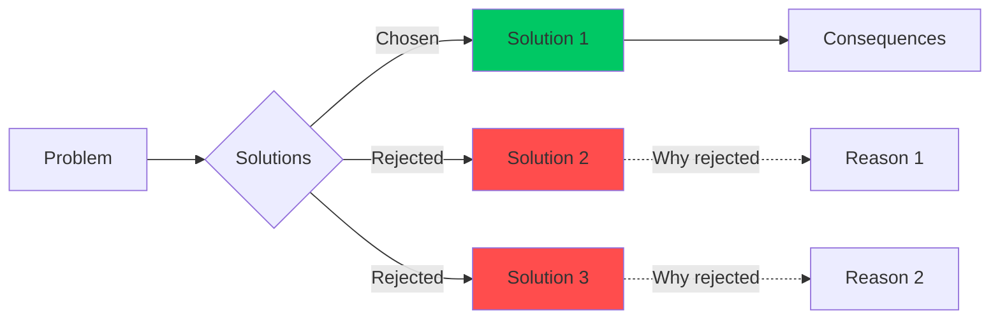

# ADR Template (with Mermaid Diagram)

## ADR-XXX: [Decision Title]

**Status**: proposed | accepted | rejected | deprecated  
**Date**: YYYY-MM-DD  
**Author**: Agent LLM (Claude Sonnet 4.5)  
**Phase**: E4 | E5 | ...  
**Bias Impact**: +X% (if applicable)

### Context
**The Problem:**
- What problem are we solving?
- Why is this a problem now?
- What constraints/pain points exist?

**The Insight:**
- What did we learn that led to this decision?
- What user feedback/data informed this?

**Current State:**
- How do things work today?
- What are the consequences of NOT making this decision?

### Decision
Implement **[Solution Name]** where:

1. **Component A:**
   - Specific change/addition
   - Rationale

2. **Component B:**
   - Specific change/addition
   - Rationale

3. **Component C:**
   - Specific change/addition
   - Rationale

### Architecture Diagram

**Key Decision Points:**
- **Before:** [What we had before]
- **After:** [What we'll have after]
- **Trade-off:** [What we gain vs. what we lose]

**Alternative Paths (if applicable):**

### Consequences

**Positive:**
- ✅ Benefit 1
- ✅ Benefit 2
- ✅ Benefit 3

**Negative:**
- ❌ Risk/cost 1
- ❌ Risk/cost 2
- ❌ Risk/cost 3

**Risks:**
- What could go wrong?
- What dependencies exist?
- What assumptions are we making?

**Alternatives Considered:**
1. **Alternative 1** → Rejected (reason)
2. **Alternative 2** → Rejected (reason)
3. **Alternative 3** → Rejected (reason)

### Implementation Status

**Phase X.Y (Current):**
- [x] Task 1 (completed: timestamp)
- [ ] Task 2 (in progress)
- [ ] Task 3 (blocked by X)

**Phase X.Z (Next):**
- [ ] Task 4
- [ ] Task 5

### Success Metrics
- Metric 1: Target value (how to measure)
- Metric 2: Target value (how to measure)
- Metric 3: Target value (how to measure)

### Validation Metrics (if implemented)
- **Metric 1:** Actual value ✅ or ❌
- **Metric 2:** Actual value ✅ or ❌
- **Metric 3:** Actual value ✅ or ❌

---

## Mermaid Diagram Guidelines

### Use Cases:
1. **Flow Diagrams** (`graph TD`): Decision flows, data flows
2. **Sequence Diagrams** (`sequenceDiagram`): Component interactions
3. **State Diagrams** (`stateDiagram-v2`): Mode transitions
4. **Comparison Diagrams** (`graph LR`): Before/After, Alternatives

### Color Codes:
- `style X fill:#667eea` — Primary/Active component (purple)
- `style X fill:#00c864` — Success/Chosen path (green)
- `style X fill:#ff4d4d` — Alert/Rejected (red)
- `style X fill:#ff9500` — Warning/Attention (orange)
- `style X fill:#666` — Background/Context (gray)

### Best Practices:
- Keep diagrams focused (max 10-15 nodes)
- Label edges with actions/data
- Use dotted lines (`-.->`) for influences/constraints
- Group related nodes with subgraphs if needed

