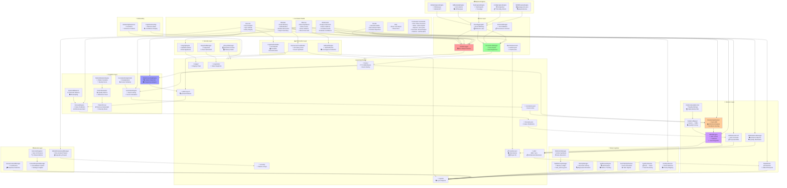

```mermaid
graph TB
    %% === 1. COMMAND ENTRYPOINTS ===
    subgraph Commands["🎯 Command Palette"]
        CmdObserve["Observe<br/>• Show Dashboard<br/>• Show Traces<br/>• Show Patterns<br/>• Show Forecasts"]
        CmdUnderstand["Understand<br/>• Analyze Decisions<br/>• Detect Patterns<br/>• Correlate Events<br/>• Evaluate Confidence"]
        CmdDecide["Decide<br/>• Generate ADRs<br/>• Recommend Tasks<br/>• Prioritize Objectives"]
        CmdExecute["Execute<br/>• Run Autopilot<br/>• Sync GitHub<br/>• Verify Integrity"]
        CmdMaintain["Maintain<br/>• Reset Memory<br/>• Edit Manifest<br/>• Enable Retroactive<br/>• Export Summary"]
        CmdHelp["Help<br/>• Show Last Report<br/>• Show Docs"]
        
        CmdContextual["Contextual Commands<br/>• Plan: Show Overview<br/>• Tasks: List/Complete<br/>• Reports: List Cycles<br/>• Forecasts: Show/Analyze<br/>• Patterns: List/Visualize"]
    end

    %% === 2. CORE ARCHITECTURE ===
    subgraph Core["⚙️ Core Layer"]
        UnifiedLogger["UnifiedLogger<br/>📺 RL3 Output Channel"]
        PersistenceManager["PersistenceManager<br/>💾 Save Events<br/>📂 .reasoning/traces/"]
        EventAggregator["EventAggregator<br/>🔄 Event Buffering<br/>⏱️ Debounce (2s)"]
        SchemaManager["SchemaManager<br/>✅ Zod Validation<br/>📋 Persistence Contract"]
        ManifestGenerator["ManifestGenerator<br/>📄 manifest.json<br/>🔢 Total Events"]
    end

    %% === 3. CAPTURE SUBSYSTEMS ===
    subgraph CaptureEngines["📥 Capture Engines"]
        SBOMCapture["SBOMCaptureEngine<br/>📦 package-lock.json<br/>🔍 Dependencies"]
        ConfigCapture["ConfigCaptureEngine<br/>⚙️ Config Files<br/>📋 TSConfig, ESLint"]
        TestCapture["TestCaptureEngine<br/>🧪 Test Reports<br/>✅ Coverage"]
        GitCapture["GitMetadataEngine<br/>🌿 Git Commits<br/>📊 Diff Analysis"]
        GitHubCapture["GitHubCaptureEngine<br/>🐙 PRs/Issues<br/>🔗 GitHub API"]
    end

    %% === 4. COGNITIVE ENGINES ===
    subgraph Cognitive["🧠 Cognitive Layer"]
        PatternLearning["PatternLearningEngine<br/>🔍 Pattern Detection<br/>📊 Frequency Analysis"]
        CorrelationEngine["CorrelationEngine<br/>🔗 Event Linking<br/>🎯 Score Calculation"]
        ForecastEngine["ForecastEngine<br/>🔮 Future Prediction<br/>⚠️ Risk Assessment"]
        CorrelationDeduplicator["CorrelationDeduplicator<br/>🧹 Deduplication<br/>📉 Cosine Similarity"]
        PatternMutation["PatternMutationEngine<br/>🎲 Pattern Variation<br/>✨ Novelty Score"]
        PatternEvaluator["PatternEvaluator<br/>📈 Quality Metrics<br/>🎯 Relevance Score"]
        PatternPruner["PatternPruner<br/>✂️ Remove Redundant<br/>🎨 Diversity Boost"]
        HistoricalBalancer["HistoricalBalancer<br/>⚖️ Thematic Balance<br/>📊 Resampling"]
    end

    %% === 5. DECISION & EVIDENCE ===
    subgraph Decision["🎯 Decision Layer"]
        RBOMEngine["RBOMEngine<br/>📝 ADR CRUD<br/>✅ Validation<br/>💾 .reasoning/adrs/"]
        DecisionSynthesizer["DecisionSynthesizer<br/>🧩 Auto-ADR<br/>📚 Historical Analysis<br/>🎯 Evidence Scoring"]
        EvidenceMapper["EvidenceMapper<br/>🔗 Events ↔ ADRs<br/>📊 Quality Scoring"]
        EvidenceQualityScorer["EvidenceQualityScorer<br/>⭐ Quality Ratings<br/>🏆 High-Quality Filter"]
        ADREvidenceManager["ADREvidenceManager<br/>📊 Evidence Reports<br/>👁️ Quality Distribution"]
        BiasMonitor["BiasMonitor<br/>⚠️ Detection<br/>🎯 Pattern/Temporal"]
        ADRGenerator["ADRGeneratorV2<br/>📝 Auto-Generate<br/>📋 Proposal ADRs"]
    end

    %% === 6. META-COGNITIVE ===
    subgraph Meta["🔄 Meta-Cognitive"]
        GoalSynthesizer["GoalSynthesizer<br/>🎯 Intent Detection<br/>📊 Priority Mapping"]
        ReflectionManager["ReflectionManager<br/>🧩 Action Synthesis<br/>⚙️ Auto-Execution"]
        TaskSynthesizer["TaskSynthesizer<br/>📋 Goal → Tasks<br/>🎨 Task Structuring"]
        AutoTaskSynthesizer["AutoTaskSynthesizer<br/>🤖 Auto-Generation<br/>📈 Task Signals"]
        SelfReviewEngine["SelfReviewEngine<br/>🔍 Self-Analysis<br/>📊 Metrics Tracking"]
        HistoryManager["HistoryManager<br/>📜 Execution History<br/>🔍 Regression Detection"]
        TaskMemoryManager["TaskMemoryManager<br/>🧠 Memory Ledger<br/>📝 task_memory.jsonl"]
    end

    %% === 7. SECURITY & INTEGRITY ===
    subgraph Security["🔐 Security Layer"]
        IntegrityEngine["IntegrityEngine<br/>🔏 SHA256 Hashes<br/>🔑 RSA Signatures"]
        SnapshotManager["SnapshotManager<br/>📸 Snapshots<br/>🔗 Chain Verification"]
        LifecycleManager["LifecycleManager<br/>⏱️ Retention Policies<br/>🗑️ Cleanup Rules"]
    end

    %% === 8. EXTERNAL INTEGRATIONS ===
    subgraph External["🌐 External Layer"]
        ExternalIntegrator["ExternalIntegrator<br/>📡 Sync All Sources<br/>🏷️ Product Metrics"]
        ContextSnapshotManager["ContextSnapshotManager<br/>📸 Consolidated Context<br/>🧩 Strategic Insights"]
        GitHubFineGrained["GitHubFineGrainedManager<br/>🐙 Fine-Grained Tokens<br/>🔒 Repository Scoped"]
        HumanContextManager["HumanContextManager<br/>👥 Contributors<br/>🎓 Expertise Detection"]
    end

    %% === 9. RETROACTIVE & AUDIT ===
    subgraph Retroactive["🕰️ Retroactive Layer"]
        RetroactiveTraceBuilder["RetroactiveTraceBuilder<br/>📜 Git History Scan<br/>🧩 Event Synthesis"]
        SelfAuditEngine["SelfAuditEngine<br/>🧠 Self-Reflection<br/>📊 Convergence Detection"]
        CognitiveRebuilder["CognitiveRebuilder<br/>🔄 Full Rebuild<br/>📚 Complete Reconstruction"]
    end

    %% === 10. ONBOARDING ===
    subgraph Onboarding["✨ Onboarding"]
        AwakeningSequence["AwakeningSequence<br/>🔄 First Boot<br/>📂 Structure Creation"]
        CognitiveGreeting["CognitiveGreeting<br/>👋 Welcome Back<br/>📊 Confidence Display"]
    end

    %% === 11. OUTPUT ARTIFACTS ===
    subgraph Artifacts[".reasoning/ Output"]
        Traces["📂 traces/<br/>YYYY-MM-DD.json<br/>🎯 Event History"]
        ADRs["📝 adrs/<br/>ADR-*.json<br/>📋 Architectural Decisions"]
        Forecasts["🔮 forecasts.json<br/>🔮 Future Predictions"]
        Patterns["🧠 patterns.json<br/>🔍 Learned Patterns"]
        Correlations["🔗 correlations.json<br/>🔗 Event Links"]
        Reports["📄 reports/<br/>📊 Cycle Reports"]
        Manifest["📋 manifest.json<br/>📊 Total Events<br/>🆔 Project ID"]
        SecurityFiles["🔐 security/<br/>🔑 Tokens & Keys"]
        Ledger["📜 ledger/<br/>🔗 Integrity Chain"]
        Snapshots["📸 snapshots/<br/>📸 State Snapshots"]
    end

    %% === COMMAND FLOWS ===
    CmdObserve --> UnifiedLogger
    CmdUnderstand --> UnifiedLogger
    CmdDecide --> UnifiedLogger
    CmdExecute --> UnifiedLogger
    CmdMaintain --> UnifiedLogger
    
    CmdObserve --> ForecastEngine
    CmdObserve --> PatternLearning
    CmdObserve --> ADREvidenceManager
    
    CmdUnderstand --> DecisionSynthesizer
    CmdUnderstand --> BiasMonitor
    CmdUnderstand --> CorrelationEngine
    
    CmdDecide --> RBOMEngine
    CmdDecide --> ADRGenerator
    CmdDecide --> GoalSynthesizer
    
    CmdExecute --> CognitiveRebuilder
    CmdExecute --> GitHubFineGrained
    CmdExecute --> IntegrityEngine
    
    CmdMaintain --> PersistenceManager
    CmdMaintain --> RetroactiveTraceBuilder
    CmdMaintain --> SelfAuditEngine

    %% === CORE FLOWS ===
    UnifiedLogger --> Artifacts
    PersistenceManager --> Traces
    EventAggregator --> PersistenceManager
    SchemaManager --> PersistenceManager
    ManifestGenerator --> Manifest

    %% === CAPTURE FLOWS ===
    SBOMCapture --> EventAggregator
    ConfigCapture --> EventAggregator
    TestCapture --> EventAggregator
    GitCapture --> EventAggregator
    GitHubCapture --> EventAggregator

    EventAggregator --> UnifiedLogger
    EventAggregator --> PersistenceManager

    %% === COGNITIVE FLOWS ===
    PatternLearning --> Patterns
    CorrelationEngine --> Correlations
    ForecastEngine --> Forecasts
    
    CorrelationDeduplicator --> CorrelationEngine
    PatternMutation --> PatternEvaluator
    PatternEvaluator --> PatternPruner
    HistoricalBalancer --> ForecastEngine

    %% === DECISION FLOWS ===
    DecisionSynthesizer --> RBOMEngine
    EvidenceMapper --> RBOMEngine
    EvidenceQualityScorer --> EvidenceMapper
    ADREvidenceManager --> ADRs
    BiasMonitor --> Reports
    ADRGenerator --> ADRs
    
    RBOMEngine --> ADRs
    RBOMEngine --> Manifest

    %% === META-COGNITIVE FLOWS ===
    GoalSynthesizer --> Reports
    ReflectionManager --> TaskMemoryManager
    TaskSynthesizer --> Reports
    AutoTaskSynthesizer --> Reports
    SelfReviewEngine --> Reports
    HistoryManager --> Reports
    TaskMemoryManager --> Reports

    %% === SECURITY FLOWS ===
    IntegrityEngine --> Ledger
    SnapshotManager --> Snapshots
    LifecycleManager --> Artifacts

    %% === EXTERNAL FLOWS ===
    ExternalIntegrator --> ContextSnapshotManager
    ContextSnapshotManager --> Reports
    GitHubFineGrained --> SecurityFiles
    HumanContextManager --> Reports

    %% === RETROACTIVE FLOWS ===
    RetroactiveTraceBuilder --> Traces
    RetroactiveTraceBuilder --> Patterns
    SelfAuditEngine --> Reports
    CognitiveRebuilder --> Artifacts

    %% === ONBOARDING FLOWS ===
    AwakeningSequence --> Artifacts
    CognitiveGreeting --> UnifiedLogger

    %% === PROCESSING PIPELINE ===
    Traces --> DecisionSynthesizer
    Traces --> PatternLearning
    Traces --> CorrelationEngine
    ADRs --> BiasMonitor
    Patterns --> ForecastEngine
    Correlations --> DecisionSynthesizer
    Forecasts --> ADRGenerator

    style UnifiedLogger fill:#ff9999
    style PersistenceManager fill:#99ff99
    style PatternLearning fill:#9999ff
    style DecisionSynthesizer fill:#ffcc99
    style RBOMEngine fill:#cc99ff
```

