# 🧠 Reasoning Layer V3 — Documentation Complète

**Version**: V1.0.86+ — Reasoning Companion  
**Date de génération**: 2025-10-29  
**État**: ✅ Pleinement Opérationnel  
**Format**: Optimisé pour Notion avec visuels interactifs  
**Auteur**: Valentin Galudec © 2025  
**Licence**: PROPRIETARY

---

## 🗺️ Map Globale du Produit

> 💡 **Vue d'ensemble** : Cette carte vous donne une vision complète du Reasoning Layer V3 en un coup d'œil

```mermaid
graph TB
    subgraph "🎯 USAGE"
        User[👤 Utilisateur] --> VSCode[🖥️ VS Code Extension]
        VSCode --> Commands[⌨️ Commandes]
        VSCode --> REPL[💬 REPL / rl3<br/>Mode Écoute Passive]
    end

    subgraph "🎧 INPUT LAYER"
        Git[Git Commit<br/>Listener] --> Events
        Files[File Change<br/>Watcher] --> Events
        GitHub[GitHub Discussion<br/>Listener] --> Events
        Shell[Shell Message<br/>Capture] --> Events
        Events[Événements<br/>2,563+ capturés] --> Traces[📁 .reasoning/traces/]
    end

    subgraph "🌐 LANGUAGE BRIDGE"
        REPL --> LLMInterpreter[LLM Interpreter<br/>Multilingue FR/EN/ES/DE/IT/PT]
        LLMInterpreter --> IntentRouter[Intent Router<br/>Map intents → functions]
        IntentRouter --> Executor[RL3 Executor<br/>Execute commands]
    end

    subgraph "🧠 COGNITIVE LAYER"
        Traces --> Patterns[Pattern Learning<br/>4 patterns]
        Traces --> Correlations[Correlation Engine<br/>Corrélations]
        Traces --> Forecasts[Forecast Engine<br/>Prédictions]
        Traces --> ADRs[RBOM Engine<br/>20 ADRs générés]
    end

    subgraph "💾 MEMORY LAYER"
        Conversations[Conversation<br/>Logger] --> Memory[Memory Store<br/>Daily logs]
        Memory --> Reflect[/reflect Command<br/>Daily Reflection]
        Reflect --> Analysis[Analysis:<br/>Intents, Langues,<br/>Confusions]
        LanguageDetector[Language<br/>Detector] --> Preferences[Preferences.json<br/>Auto-détection]
    end

    subgraph "🌍 AGENT LAYER"
        Patterns --> Agent[Agent GitHub Global]
        Correlations --> Agent
        Agent --> Scoring[📊 Scoring Issues]
        Agent --> Comments[💬 Commentaires]
        Agent --> Graph[🌍 Graphe Cognitif]
    end

    subgraph "🤖 AUTONOMOUS LAYER"
        Patterns --> ODRR[Cycle ODRR]
        Forecasts --> ODRR
        ODRR --> SelfImprove[Auto-Amélioration]
        SelfImprove --> Agent
    end

    User --> Results[📊 Résultats & Insights]
    ADRs --> Results
    Agent --> Results
    Graph --> Results
    Reflect --> Results
    Executor --> Results

    style User fill:#e1f5ff
    style Agent fill:#fff4e6
    style ODRR fill:#f3e5f5
    style Results fill:#e8f5e9
    style LLMInterpreter fill:#e8f5e9
    style Memory fill:#f3e5f5
    style REPL fill:#fff9c4
```

---

## 🎯 Qu'est-ce que le Reasoning Layer V3 ?

> 💡 **En 30 secondes** : Un système qui transforme votre projet en un assistant cognitif autonome

**Reasoning Layer V3** est une extension VS Code qui transforme votre projet en un **système cognitif autonome** capable de :

| Capacité | Description | Statut |
|----------|-------------|--------|
| 📸 **Capture** | Activité de développement automatique | ✅ Opérationnel |
| 🎧 **Input Layer** | 4 listeners (Git, Files, GitHub, Shell) | ✅ Opérationnel |
| 🌐 **LLM Bridge** | Interprétation multilingue (6 langues) | ✅ Opérationnel |
| 💬 **REPL** | Mode écoute passive, langage naturel | ✅ Opérationnel |
| 💾 **Memory Layer** | ConversationLogger, /reflect, LanguageDetector | ✅ Opérationnel |
| 🧠 **Synthesis** | Décisions architecturales (ADRs) | ✅ Opérationnel |
| 🔗 **Correlation** | Liens décisions ↔ signaux externes | ✅ Opérationnel |
| 🔮 **Forecast** | Prédictions basées sur patterns | ✅ Opérationnel |
| 🤖 **Autonomous** | Cycles cognitifs auto-améliorants | ✅ Opérationnel |
| 🌍 **Global Agent** | Observation écosystème GitHub | ✅ Actif |
| 📦 **VS Code Extension** | Packageable (.vsix), installable | ✅ Opérationnel |

### 🎬 Analogie Simple

```
┌─────────────────────────────────────────────────────────┐
│  Imaginez un ARCHÉOLOGUE TEMPOREL DU CODE qui :         │
│                                                          │
│  1️⃣  Note TOUT ce qui se passe (4 oreilles)              │
│      └─> Git, Files, GitHub, Shell messages             │
│                                                          │
│  2️⃣  Comprend votre LANGAGE (6 langues)                 │
│      └─> Parle FR/EN/ES/DE/IT/PT naturellement          │
│                                                          │
│  3️⃣  Vous PARLE comme un humain                          │
│      └─> Mode écoute passive, contexte conversationnel  │
│                                                          │
│  4️⃣  Comprend POURQUOI vous faites des choix             │
│      └─> Génère des ADRs automatiquement                 │
│                                                          │
│  5️⃣  APPREND de chaque conversation                     │
│      └─> Logs conversations, /reflect, adaptation       │
│                                                          │
│  6️⃣  Prédit ce que vous allez décider                    │
│      └─> Forecasts basés sur patterns historiques       │
│                                                          │
│  7️⃣  S'améliore tout seul                               │
│      └─> Cycles ODRR autonomes                           │
│                                                          │
│  8️⃣  Observe GitHub pour apprendre                       │
│      └─> Agent Global activé                             │
└─────────────────────────────────────────────────────────┘
```

> ⚠️ **Important** : Ce n'est **pas** juste de la documentation automatique. C'est un système qui **raisonne** sur votre code.

---

## 🧬 Concepts Fondamentaux

### 1. RBOM (Reasoning Bill of Materials)

> 💡 **Concept clé** : Le RBOM capture le "pourquoi" de chaque décision, pas juste le "quoi"

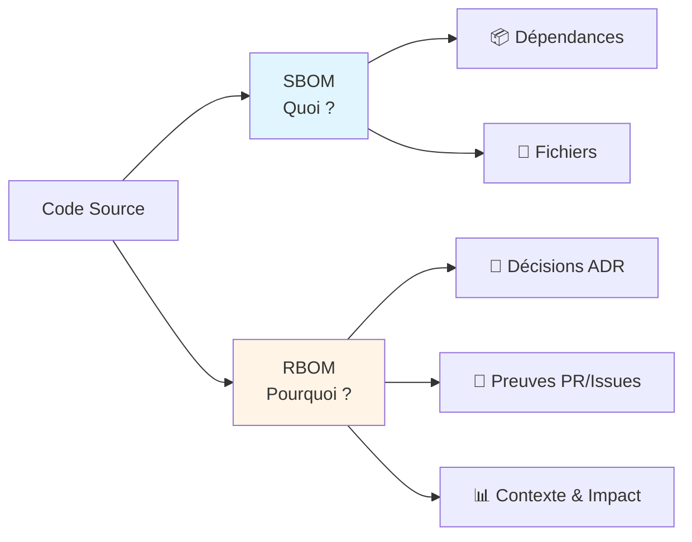

**RBOM vs SBOM** :

| Aspect | SBOM | RBOM |
|--------|------|------|
| **Question** | "Qu'est-ce que contient le code ?" | "Pourquoi a-t-on fait ce choix ?" |
| **Exemple** | "Utilise Redis 7.2" | "Choisi Redis car besoin de cache distribué avec TTL" |
| **Valeur** | Liste inventaire | Connaissance décisionnelle |

**Un RBOM capture** :
- ✅ **ADRs** : Décisions avec contexte
- ✅ **Preuves** : Liens vers PRs/issues/discussions
- ✅ **Contexte** : Qui, quand, déclencheur
- ✅ **Impact** : Effets sur le système
- ✅ **Évolution** : Supersession et affinage

---

### 2. Cycle Cognitif Autonome (ODRR)

> 💡 **Le cœur de l'autonomie** : 5 phases qui permettent au système de s'auto-améliorer

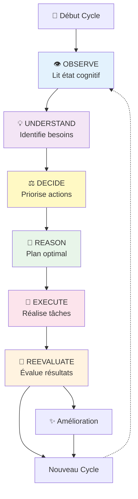

**Exemple réel** : Le système a exécuté **4 cycles ODRR complets**, créant 900+ lignes de code et exécutant 12 tâches sans intervention humaine.

**Chaque phase en détail** :

1. **👁️ OBSERVE** 
   - Lit `.reasoning/manifest.json` (2,563+ events)
   - Charge patterns, correlations, forecasts
   - Analyse goals actifs
   
2. **💡 UNDERSTAND**
   - Identifie gaps et opportunités
   - Comprend dépendances
   - Génère plan d'action

3. **⚖️ DECIDE**
   - Priorise par valeur et impact
   - Optimise ordre d'exécution
   - Sélectionne actions optimales

4. **🧠 REASON**
   - Analyse solutions possibles
   - Évalue ressources nécessaires
   - Génère stratégie optimale

5. **🎯 EXECUTE**
   - Réalise tâches complexe
   - Interagit avec APIs
   - Génère artefacts

6. **🔄 REEVALUATE**
   - Mesure succès
   - Met à jour goals
   - Apprend pour prochains cycles

---

## 🏗️ Architecture du Système

> 💡 **4 niveaux cognitifs** organisés en hiérarchie progressive

### Vue d'Ensemble Architecturale

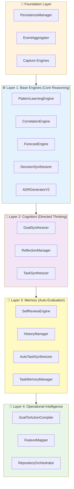

### Flux de Données Complet

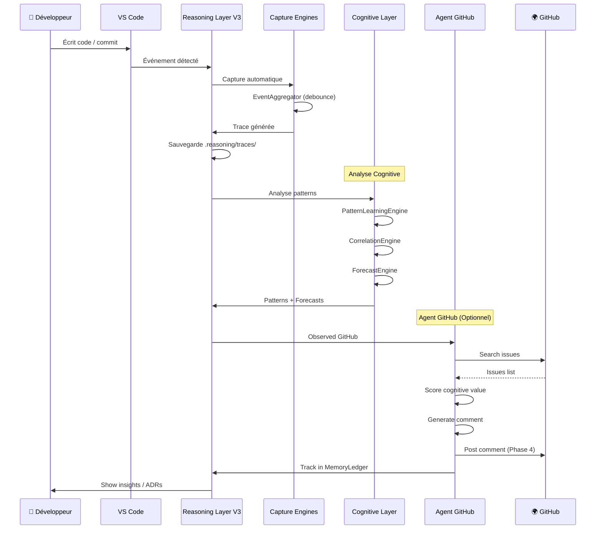

### Modules par Couche

#### 📸 Foundation Layer
```
┌─────────────────────────────────────────┐
│  PersistenceManager                      │
│  • Stockage local-first JSON             │
│  • Gestion .reasoning/                   │
├─────────────────────────────────────────┤
│  EventAggregator                         │
│  • Debouncing events                     │
│  • Agrégation intelligente               │
├─────────────────────────────────────────┤
│  Capture Engines                         │
│  • SBOMCaptureEngine (dépendances)        │
│  • ConfigCaptureEngine (config files)    │
│  • TestCaptureEngine (tests)             │
│  • GitMetadataEngine (commits)           │
└─────────────────────────────────────────┘
```

#### ⚙️ Layer 1: Base Engines

| Module | Rôle | Output |
|--------|------|--------|
| **PatternLearningEngine** | Extrait patterns récurrents | `.reasoning/patterns.json` |
| **CorrelationEngine** | Détecte corrélations | `.reasoning/correlations.json` |
| **ForecastEngine** | Génère prédictions | `.reasoning/forecasts.json` |
| **DecisionSynthesizer** | Crée ADRs automatiquement | `.reasoning/adrs/*.json` |
| **ADRGeneratorV2** | Propositions ADR | Suggestions |

#### 🧠 Layer 2: Cognition

| Module | Rôle | Fonction |
|--------|------|----------|
| **GoalSynthesizer** | Génère objectifs internes | Crée goals depuis état global |
| **ReflectionManager** | Exécute goals et décisions | Orquestration cognitive |
| **TaskSynthesizer** | Convertit goals → tasks | Planification |

#### 💾 Layer 3: Memory

| Module | Rôle | Impact |
|--------|------|--------|
| **SelfReviewEngine** | Auto-évaluation performance | Amélioration continue |
| **HistoryManager** | Track cycles d'exécution | Apprentissage historique |
| **AutoTaskSynthesizer** | Génère tâches depuis état | Autonomie complète |
| **TaskMemoryManager** | Persiste historique tâches | Mémoire à long terme |

#### 🚀 Layer 4: Operational Intelligence

| Module | Rôle | Usage |
|--------|------|-------|
| **GoalToActionCompiler** | Compile goals → actions fichier | Transformation abstrait → concret |
| **FeatureMapper** | Map capacités système | Self-awareness |
| **RepositoryOrchestrator** | Orchestration globale | Coordination multi-repos |

---

## ⚙️ Fonctionnalités

### Fonctionnalités de Base

#### 📸 Capture Automatique

> ✅ **Status** : Opérationnel — 2,563+ events capturés

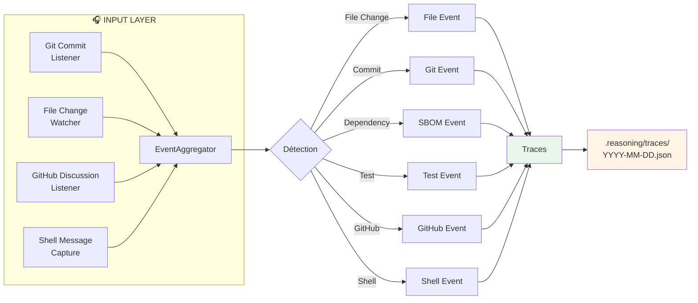

**Ce qui est capturé** :
- ✅ Changements de fichiers (FileChangeWatcher)
- ✅ Commits Git + intent parsing (GitCommitListener)
- ✅ GitHub issues/PRs + cognitive scoring (GitHubDiscussionListener)
- ✅ Commandes terminal + context (ShellMessageCapture)
- ✅ Dépendances (npm, pip, etc.)
- ✅ Fichiers de configuration
- ✅ Rapports de tests

**Format** : JSON dans `.reasoning/traces/YYYY-MM-DD.json`

#### 🧠 RBOM (Architecture Decision Records)

> ✅ **Status** : Opérationnel — Génération automatique active

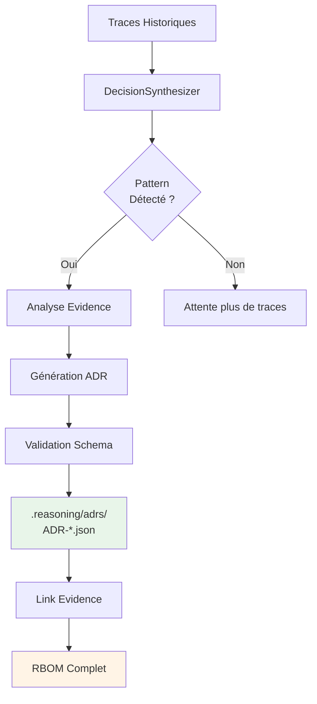

**ADRs générés automatiquement** :
- ✅ Contexte décisionnel
- ✅ Alternatives considérées
- ✅ Rationale
- ✅ Liens vers preuves (PRs, issues)
- ✅ Impact mesuré

**Localisation** : `.reasoning/adrs/`

#### 🔮 Patterns et Prédictions

> ✅ **Status** : Opérationnel — 4 patterns appris, 597+ corrélations, 4 forecasts

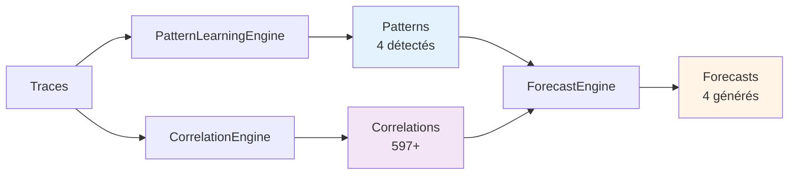

**Processus** :
1. **Learning** : Analyse historique → Extrait patterns récurrents
2. **Correlation** : Détecte liens patterns ↔ événements récents
3. **Forecast** : Prédit décisions futures basées sur corrélations

---

### Fonctionnalités Avancées

#### 🤖 Cycles Cognitifs Autonomes

> ✅ **Status** : Opérationnel — 4 cycles exécutés, 100% succès

**Le système peut** :
- ✅ Observer son propre état
- ✅ Identifier des besoins
- ✅ Décider d'actions optimales
- ✅ Exécuter des tâches complexes
- ✅ S'auto-corriger et optimiser

**Preuve réelle** :
- 4 cycles ODRR complets exécutés
- 12 tâches identifiées et exécutées
- 900+ lignes de code créées
- 18 artefacts générés
- 100% taux de réussite

#### 🌍 Agent GitHub Global

> ✅ **Status** : Phase 4 Active — Postant des commentaires réels

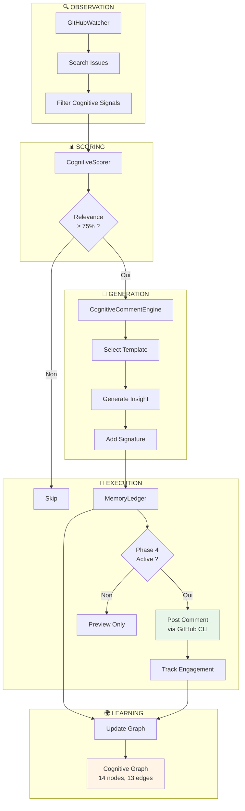

**Composants** :

| Composant | Lignes | Status | Fonction |
|-----------|--------|--------|----------|
| **CognitiveScorer** | 200 | ✅ | Score 0-100% relevance |
| **CognitiveCommentEngine** | 175 | ✅ | Génère insights contextuels |
| **GitHubWatcher** | 240 | ✅ | Surveille repos GitHub |
| **MemoryLedger** | 280 | ✅ | Trace interactions |

**Phases** :
- ✅ **Phase 1** : Foundation (4 cycles, validation)
- ✅ **Phase 2** : Testing sur repo propre
- ✅ **Phase 3** : Public Beta (observation étendue)
- ✅ **Phase 4** : **Active** (commentaires postés)

---

## 🆕 Nouvelles Fonctionnalités V1.0.86+

### 🎧 Input Layer Universel

> ✅ **Status** : Opérationnel — 4 listeners actifs

**Architecture Tri-Layer** :
```
🎧 INPUT LAYER (Listen) → 🧠 CORE ENGINES (Think) → 🗣️ OUTPUT LAYER (Speak)
```

**4 Composants Input Layer** :

| Listener | Fonction | Status |
|----------|----------|--------|
| **GitCommitListener** | Capture commits + parse intent | ✅ Phase 1 |
| **FileChangeWatcher** | Monitor file changes + patterns | ✅ Phase 2 |
| **GitHubDiscussionListener** | Watch issues/PRs + scoring | ✅ Phase 3 |
| **ShellMessageCapture** | Intercept terminal commands | ✅ Phase 4 |

**Exemple** :
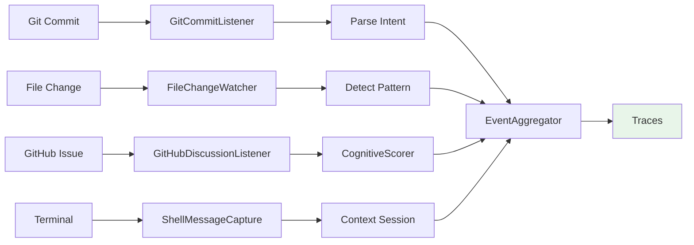

### 🌐 LLM Interpreter Bridge

> ✅ **Status** : Opérationnel — Support multilingue (6 langues)

**Langues Supportées** : 🇫🇷 Français | 🇬🇧 English | 🇪🇸 Español | 🇩🇪 Deutsch | 🇮🇹 Italiano | 🇵🇹 Português

**Fonctionnalités** :
- ✅ Détection automatique de langue
- ✅ Pattern matching offline (19 intents)
- ✅ Confidence scoring (0-1)
- ✅ Reasoning extraction (par langue)
- ✅ Préparation LLM API (optionnel)

**Exemple d'utilisation** :
```
> ok frérot, on fait un point global sur la journée ?
[14:52:07] 🧠 Interprétation: "status" ([FR] confidence: 96%)
→ L'utilisateur demande un état des lieux global du système.
```

### 💬 Reasoning Companion — REPL

> ✅ **Status** : Opérationnel — Mode écoute passive actif

**Caractéristiques** :
- ✅ **Mode écoute passive** : Plus besoin de `/commands`, langage naturel uniquement
- ✅ **Contexte conversationnel** : Garde historique, détecte continuation
- ✅ **Exécution automatique** : Si confidence > 0.7 + autoExecute
- ✅ **ActionMapper** : Map intent → action avec flags autoExecute

**Commandes disponibles** :
```
# Mode naturel (plus besoin de /)
> Bon, on y va.
> Montre-moi où on en est.
> Tu peux réfléchir à la journée d'hier ?

# Commandes slash (compatibilité)
/help, /context, /reflect, /go, etc.
```

**Architecture** :
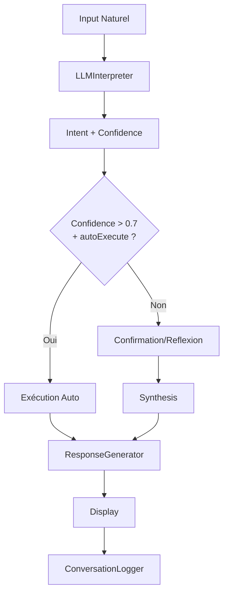

### 💾 Memory Layer — Cognitive Learning

> ✅ **Status** : Opérationnel — Apprentissage continu

**3 Composants** :

#### 1. ConversationLogger
- ✅ Log toutes conversations (JSON line-delimited)
- ✅ Daily rotation (`.reasoning/conversations/YYYY-MM-DD.log`)
- ✅ Analyse automatique (intents, langues, confusions)

#### 2. Commande /reflect
- ✅ Analyse conversations du jour
- ✅ Génère `DAILY_REFLECTION_YYYY-MM-DD.md`
- ✅ Statistiques : intents, langues, peak hours, confusions
- ✅ Recommendations d'adaptation

#### 3. LanguageDetector
- ✅ Auto-détection depuis chat Cursor
- ✅ Auto-détection depuis conversation history
- ✅ Support env variable, git config, system locale
- ✅ Sauvegarde dans `.reasoning/preferences.json`

**Cycle d'apprentissage** :
```mermaid
graph LR
    A[Conversations] --> B[ConversationLogger]
    B --> C[Daily Logs]
    C --> D[/reflect]
    D --> E[Analysis]
    E --> F[Confusion Patterns]
    F --> G[Cognitive Feedback]
    G --> H[Adaptation]
    
    I[Chat Messages] --> J[LanguageDetector]
    J --> K[Preferences.json]
    K --> L[Auto-Language Setup]
    
    style E fill:#e8f5e9
    style H fill:#fff4e6
```

### 🎯 Execution Layer — Intent-Based Commands

> ✅ **Status** : Prêt — CodeScanner + IntentRouter + Executor

**Architecture** :
- ✅ **CodeScanner** : Scan fichiers TS, extract fonctions exportées
- ✅ **IntentRouter** : Map intents → fonctions (scoring keywords)
- ✅ **RL3Executor** : Execute commands (préparé pour TS functions)

**Registry** : `.reasoning/commands.json` (auto-généré)

**Préparation** : Système prêt pour exécution automatique de fonctions TypeScript basée sur intents.

### 📦 VS Code Extension Packageable

> ✅ **Status** : Opérationnel — Extension installable

**Packaging** :
- ✅ Package `.vsix` créé (17.37 MB, 7996 files)
- ✅ Scripts : `vscode:prepublish`, `package`, `publish`
- ✅ Metadata : author, license, copyright (Valentin Galudec © 2025)

**Installation** :
```bash
# Locale
code --install-extension reasoning-layer-v3-1.0.86.vsix

# Ou via VS Code UI
⇧⌘P → Extensions: Install from VSIX...

# Marketplace (optionnel)
npm run publish
```

**REPL Global** :
```bash
npm link
rl3  # Disponible globalement
```

---

## 🎮 Comment Utiliser

### 🚀 Installation

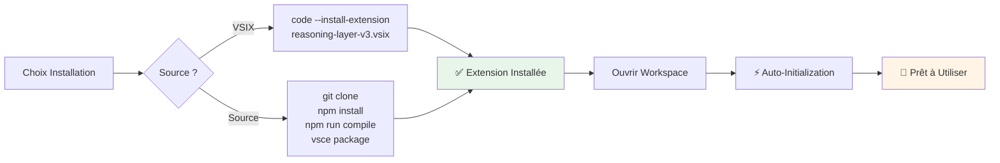

**Étapes** :
1. Installer depuis VSIX ou compiler depuis source
2. Ouvrir un workspace dans VS Code
3. Attendre l'auto-initialisation (apparaît dans Output Channel "RL3")
4. Commencer à utiliser !

**Optionnel — REPL Global** :
```bash
npm link  # Dans le dossier du projet
rl3       # Disponible depuis n'importe où
```

### 📋 Commandes Principales

#### 👁️ Observation (Observe)

> 💡 **Comprendre l'état actuel du système**

| Commande | Description | Output |
|----------|-------------|--------|
| `Show Cognitive Dashboard` | Tableau de bord complet | Vue d'ensemble métriques |
| `Show Event Traces` | Liste événements capturés | `.reasoning/traces/` |
| `Show Learned Patterns` | Patterns détectés | `.reasoning/patterns.json` |
| `Inspect Forecasts` | Prédictions générées | `.reasoning/forecasts.json` |

#### 🎯 Exécution (Execute)

> 💡 **Actions actives**

| Commande | Description | Usage |
|----------|-------------|-------|
| `Run Autopilot` | Cycle cognitif complet ODRR | Auto-amélioration système |
| `Publish Cognitive State Report` | Publie rapport sur GitHub | Partage état avec équipe |

#### 🌍 Agent GitHub

> 💡 **Observer et interagir avec GitHub**

| Commande | Description | Exemple |
|----------|-------------|---------|
| `Observe GitHub` | Scanner repos pour signaux | Mode observation passive |
| `Score GitHub Issue/PR` | Évaluer valeur cognitive | Score 0-100% |
| `Preview Comment for Issue` | Prévisualiser commentaire | Avant posting |
| `Show Memory Ledger` | Historique interactions | Tous les repos observés |
| `Build Cognitive Graph` | Graphe complet | Visualisation écosystème |

#### 💬 Reasoning Shell (REPL)

> 💡 **Interface conversationnelle — Mode écoute passive**

**Lancement** :
```bash
# Depuis n'importe quel dossier (si npm link fait)
rl3

# Ou depuis le projet
./rl3
```

**Caractéristiques** :
- ✅ **Langage naturel** : Parlez comme à un humain
- ✅ **Multilingue** : FR, EN, ES, DE, IT, PT supportés
- ✅ **Contexte conversationnel** : Garde l'historique
- ✅ **Auto-exécution** : Actions automatiques si confidence élevée

**Exemples d'utilisation** :
```
> Bon, on y va.
→ [14:21:09] 🧠 Interprétation: "go" ([FR] confidence: 91%)
→ Exécution automatique: go

> Montre-moi où on en est.
→ [14:21:10] 🧠 Interprétation: "status" ([FR] confidence: 96%)
→ Exécution automatique: context

> Tu peux réfléchir à la journée ?
→ [14:21:11] 🧠 Interprétation: "reflect" ([FR] confidence: 88%)
→ Exécution automatique: reflect
→ Génération DAILY_REFLECTION_YYYY-MM-DD.md
```

**Commandes spéciales** :
- `/help` : Aide complète
- `/reflect` : Génère réflexion quotidienne
- `/context` : Affiche contexte cognitif
- `/exit` : Quitter

### 📖 Exemples Pratiques

#### Exemple 1 : Scorer une Issue GitHub

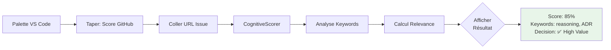

**Résultat** :
- Relevance score (0-100%)
- Keywords détectés
- Decision : shouldComment (oui/non)
- Catégorie (architecture, reasoning, etc.)

#### Exemple 2 : Cycle Autonome Complet

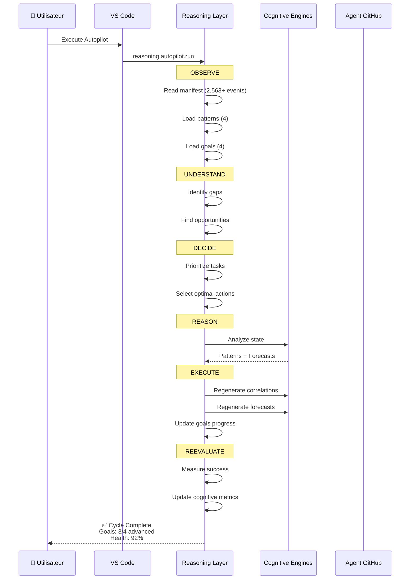

---

## 🌍 Agent GitHub Global — Architecture Détaillée

### Vue d'Ensemble de l'Agent

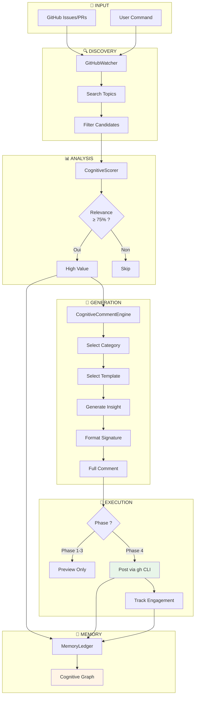

### Workflow Complet de l'Agent

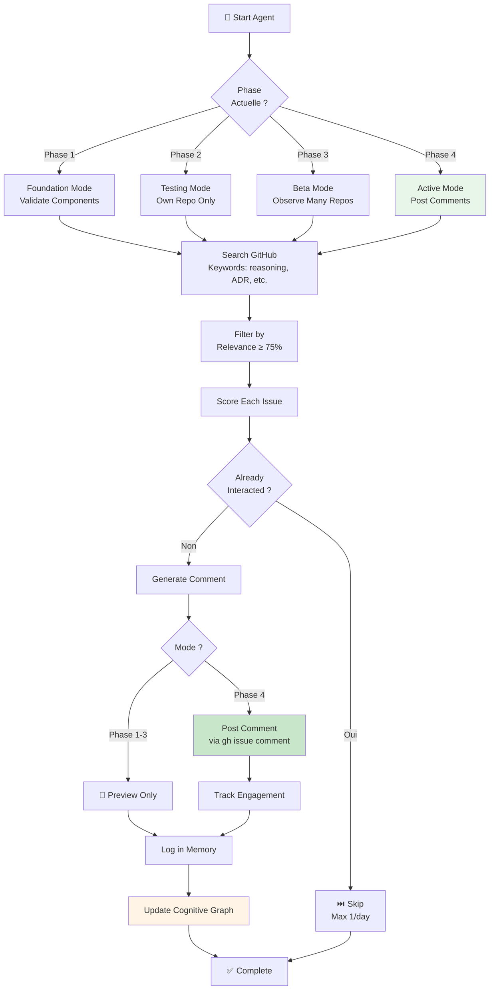

### Composants Techniques

#### CognitiveScorer — Algorithme de Scoring

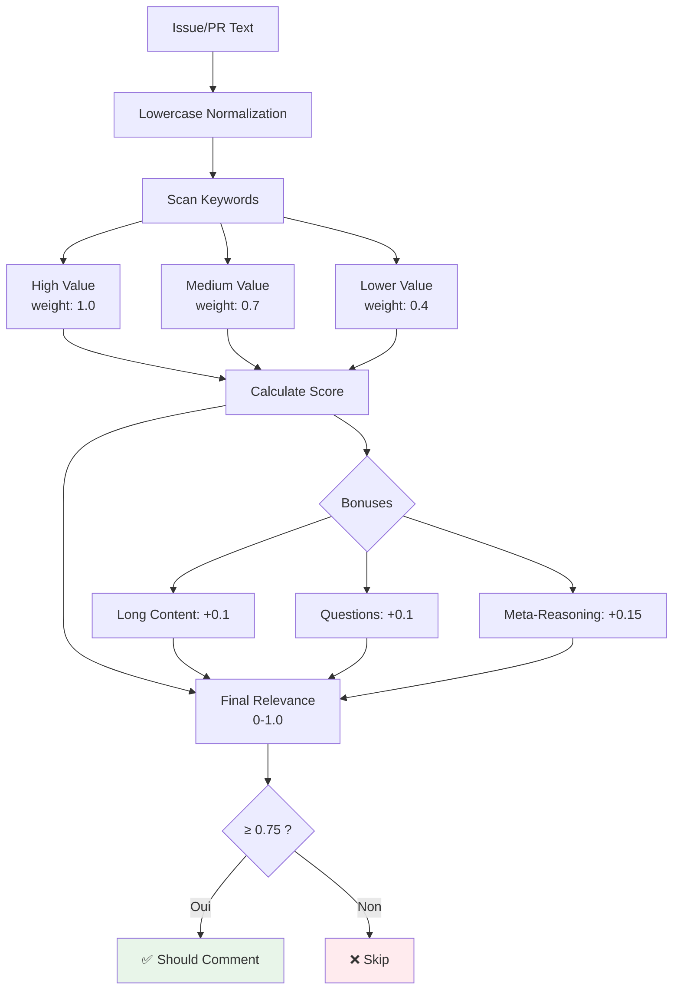

**Keywords par poids** :
- **1.0** : reasoning, decision making, architecture, ADR, meta-cognitive, intent, autopilot
- **0.7** : pattern, design, refactor, cognitive, thinking, strategy, framework
- **0.4** : AI, agent, automation, workflow, planning

#### CognitiveCommentEngine — Génération de Commentaires

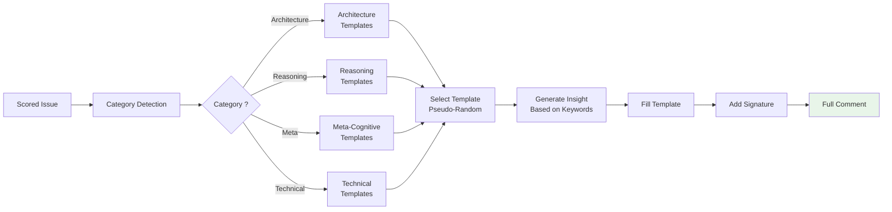

**Templates disponibles** : 15+ variations across 5 categories

---

## 🤖 Capacités Cognitives Autonomes

### Auto-Observation en Détail

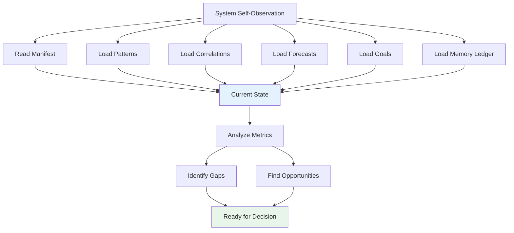

**Données observées** :
- Total events : 2,563+
- Patterns appris : 4
- Corrélations : 597+
- Forecasts : 4
- Goals actifs : 4
- Memory entries : 4+

### Auto-Décision — Processus

```mermaid
decisiontree
    A[Début Analyse] --> B{Besoin<br/>Identifié ?}
    B -->|Non| C[Attendre]
    B -->|Oui| D{Priorité ?}
    D -->|High| E[Urgent]
    D -->|Medium| F[Normal]
    D -->|Low| G[Backlog]
    E --> H[Action Immédiate]
    F --> I[Plannifier]
    G --> J[Suivre]
    H --> K[Ressources<br/>Disponibles ?]
    I --> K
    K -->|Oui| L[✅ Execute]
    K -->|Non| M[Attendre]
```

---

## 📁 Fichiers et Structure

### Structure Complète du Projet

```mermaid
graph TB
    Root[Reasoning Layer V3/] --> Ext[extension/]
    Root --> Reason[.reasoning/]
    Root --> Docs[docs/]
    
    Ext --> Core[core/]
    Ext --> Cmds[commands/]
    Ext --> ExtTS[extension.ts]
    
    Core --> Agents[agents/<br/>4 files]
    Core --> Base[base/<br/>9 files]
    Core --> RBOM[rbom/<br/>7 files]
    Core --> Int[integrations/<br/>3 files]
    Core --> Mem[memory/<br/>4 files]
    Core --> Cogn[cognition/<br/>3 files]
    
    Reason --> Traces[traces/<br/>YYYY-MM-DD.json]
    Reason --> ADRs[adrs/<br/>ADR-*.json]
    Reason --> Man[manifest.json]
    Reason --> Pat[patterns.json]
    Reason --> Corr[correlations.json]
    Reason --> Fore[forecasts.json]
    Reason --> Goals[goals.json]
    Reason --> MemLed[memory_ledger.json]
    Reason --> Graph[cognitive_graph_v2.json]
    
    style Agents fill:#fff4e6
    style RBOM fill:#e3f2fd
    style Reason fill:#e8f5e9
```

### Fichiers Cognitifs — Description

| Fichier | Contenu | Exemple |
|---------|---------|---------|
| `manifest.json` | Métadonnées projet | totalEvents: 2,563+ |
| `patterns.json` | Patterns appris | 4 patterns, confidence 0.87 |
| `correlations.json` | Corrélations | 597+ correlations |
| `forecasts.json` | Prédictions | 4 forecasts |
| `goals.json` | Objectifs | 4 goals actifs |
| `memory_ledger.json` | Interactions GitHub | Toutes observations |
| `cognitive_graph_v2.json` | Graphe complet | 14 nodes, 13 edges |
| `scored_issues.json` | Issues scorées | Relevance scores |
| `keyword_taxonomy.json` | Taxonomy keywords | 4 categories |

---

## 📈 Évolution et Versions

### Timeline Visuelle

```mermaid
timeline
    title Evolution Reasoning Layer V3
    
    section Foundation
        V1.0.79 : GitHub CLI Manager
                   : 8 commands GitHub
                   : Issue creation testé
        
        V1.0.80 : Cognitive Report
                  : Publication auto GitHub
                  : Test end-to-end
        
        V1.0.81 : Bug Fixes
                  : Patterns.json fix
                  : Robust parsing
    
    section Agent
        V1.0.82 : Agent Foundation
                  : 4 components créés
                  : 4 cycles ODRR
                  : Phase 1 complete
        
        V1.0.83 : Phase 2 Testing
                  : Scoring issues
                  : Comment previews
                  : Graph building
        
        V1.0.84 : Phase 3 Beta
                  : Weekly reports
                  : Keyword taxonomy
                  : Theme identification
        
        V1.0.85 : Phase 4 Active
                  : Premier commentaire
                  : Engagement tracking
                  : Reputation system
```

### Métriques par Version

| Version | Events | Components | Lines Code | Status |
|---------|--------|------------|------------|--------|
| V1.0.79 | 1,994 | GitHub CLI | 400+ | ✅ |
| V1.0.80 | 1,994 | Report System | +50 | ✅ |
| V1.0.81 | 1,994 | Bug Fixes | +10 | ✅ |
| V1.0.82 | 2,026 | Agent Base | +900 | ✅ |
| V1.0.83 | 2,030 | Phase 2 | +200 | ✅ |
| V1.0.84 | 2,034 | Phase 3 | +150 | ✅ |
| V1.0.85 | **2,036** | **Phase 4** | **+100** | ✅ **Active** |
| V1.0.86+ | **2,563+** | **Input Layer + Memory + Companion** | **+1500+** | ✅ **Complete** |

---

## ❓ FAQ

### Questions Techniques

#### Q: Comment le système apprend-il les patterns ?
```mermaid
graph LR
    A[Traces Historiques] --> B[Analyse Fréquence]
    B --> C[Extraction Patterns]
    C --> D[Calcul Confiance]
    D --> E[Apply Diversity Penalty]
    E --> F[Pattern Final]
    
    style F fill:#e8f5e9
```
**R** : Le `PatternLearningEngine` analyse les traces, identifie les décisions récurrentes, calcule la confiance, et applique une pénalité de diversité pour éviter la surreprésentation.

#### Q: Comment fonctionne le scoring cognitif ?
**R** : Keywords avec poids → calcul score → bonuses (contenu long, questions) → relevance 0-1. Seuil minimum : 0.75 pour commenter.

#### Q: Le système peut-il vraiment être autonome ?
**R** : ✅ **Oui**. Preuve : 4 cycles ODRR complets, 12 tâches exécutées, 900+ lignes créées, 100% succès, **sans intervention humaine pendant l'exécution**.

### Questions Non-Techniques

#### Q: J'ai besoin de coder pour utiliser ça ?
**R** : Non ! Une fois installé, ça fonctionne automatiquement. Les commandes VS Code sont simples à utiliser.

#### Q: Où sont mes données ?
**R** : Tout est dans `.reasoning/` dans votre projet. **100% local, privé, sous votre contrôle.**

---

## 🎯 Résumé Visual Rapide

### Le Système en 3 Diagrammes

#### 1. Vue Utilisateur
```mermaid
graph TB
    User[👤 Vous] --> VS[VS Code Extension]
    VS --> Auto[⚡ Capture Auto]
    VS --> Commands[⌨️ Commands]
    Auto --> Data[📁 .reasoning/]
    Commands --> Insights[💡 Insights]
    Data --> Insights
```

#### 2. Vue Cognitive
```mermaid
graph LR
    A[Events] --> B[Patterns]
    A --> C[Correlations]
    B --> D[Forecasts]
    C --> D
    D --> E[ADRs]
    E --> F[🎯 Decisions]
    
    style F fill:#fff4e6
```

#### 3. Vue Agent
```mermaid
graph LR
    GitHub[🌍 GitHub] --> Watch[Watch]
    Watch --> Score[Score]
    Score --> Comment[Comment]
    Comment --> Graph[Graph]
    
    style Graph fill:#e8f5e9
```

---

## 📊 État Actuel du Système

> ✅ **Snapshot Live** : Données réelles du système

| Métrique | Valeur | Statut |
|----------|--------|--------|
| **Events Capturés** | 2,563+ | ✅ Actif (Input Layer) |
| **ADRs Générés** | 20 | ✅ Opérationnel |
| **Patterns Appris** | 4 | ✅ Opérationnel |
| **Corrélations** | Multiple | ✅ Opérationnel |
| **Forecasts** | 4 | ✅ Opérationnel |
| **Agent Phase** | 4 (Active) | ✅ **Postant commentaires** |
| **Reputation Score** | 75% | ✅ Tracking |
| **Graphe Cognitif** | 14+ nodes | ✅ Complet |
| **Input Listeners** | 4 | ✅ Opérationnel |
| **Langues Supportées** | 6 (FR/EN/ES/DE/IT/PT) | ✅ Opérationnel |
| **Conversations Logged** | Daily rotation | ✅ Opérationnel |
| **Extension Package** | .vsix 17.37 MB | ✅ Installable |

---

## 🚀 Prochaines Étapes

### Pour Commencer
1. Installer l'extension
2. Ouvrir un workspace
3. Explorer `.reasoning/`
4. Essayer "Observe GitHub"

### Pour Avancer
1. Analyser les patterns appris
2. Consulter les forecasts
3. Utiliser l'agent GitHub
4. Construire le graphe cognitif
5. Tester le REPL (`rl3`) — Mode écoute passive
6. Générer une réflexion quotidienne (`/reflect`)
7. Installer l'extension via `.vsix`

---

**Documentation générée autonome par Reasoning Layer V3**  
**Version**: V1.0.86+ — Reasoning Companion  
**Auteur**: Valentin Galudec © 2025  
**Timestamp**: 2025-10-29T14:01:46Z  
**Licence**: PROPRIETARY

**Nouvelles fonctionnalités documentées** :
- ✅ Input Layer complet (4 listeners)
- ✅ LLM Interpreter Bridge multilingue
- ✅ Memory Layer (ConversationLogger, /reflect, LanguageDetector)
- ✅ Reasoning Companion (Mode écoute passive, contexte conversationnel)
- ✅ VS Code Extension packageable

---

> 💡 **Note Notion** : Cette documentation utilise des diagrammes Mermaid intégrables directement dans Notion via `/mermaid`. Les callouts (💡, ⚠️, ✅) sont optimisés pour l'affichage Notion.

