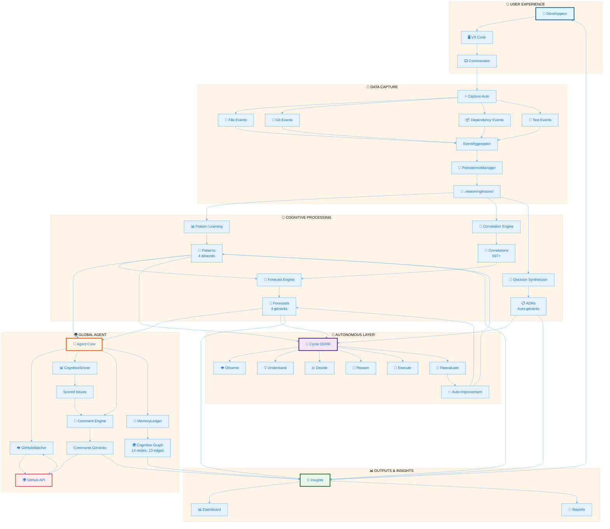
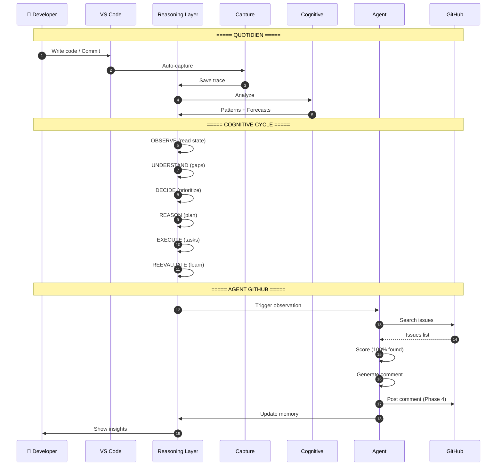
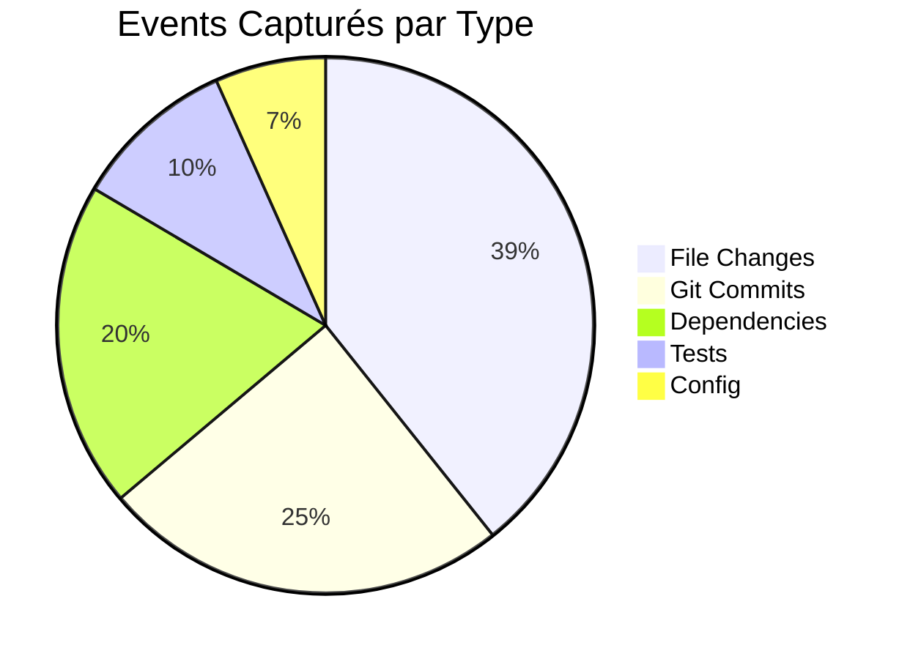
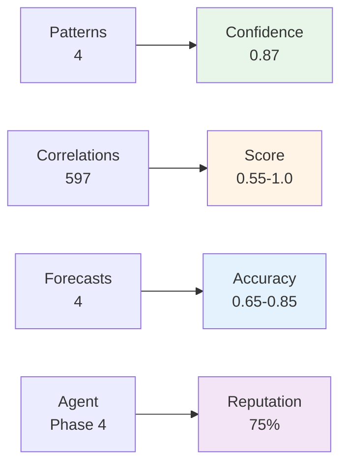
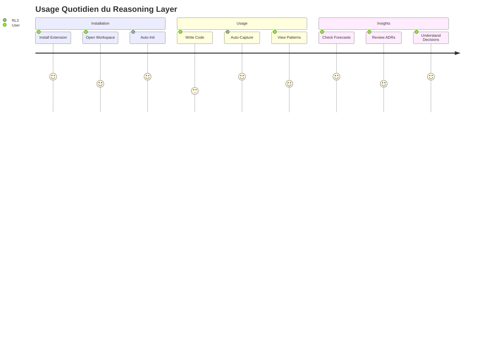
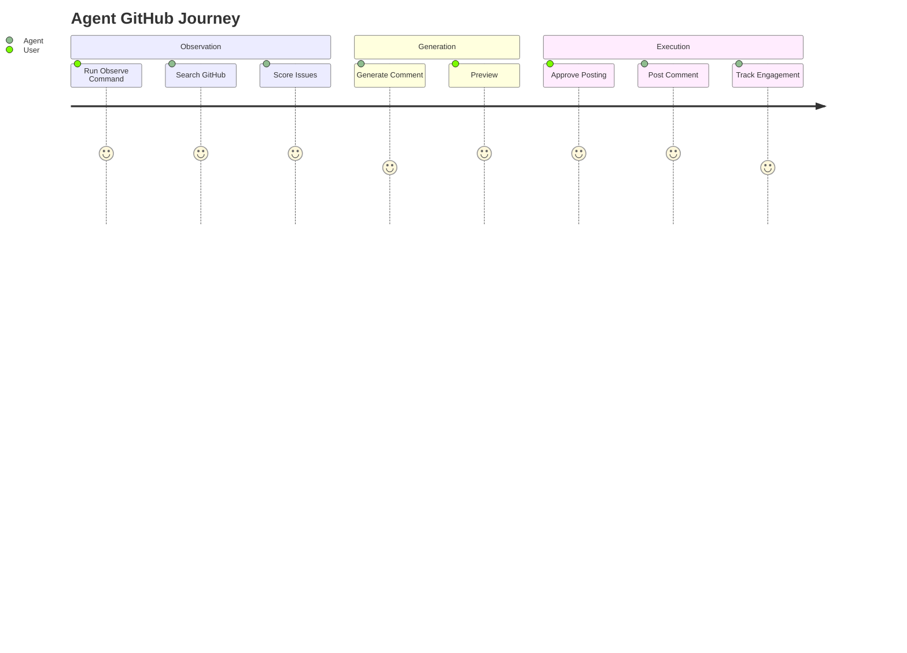
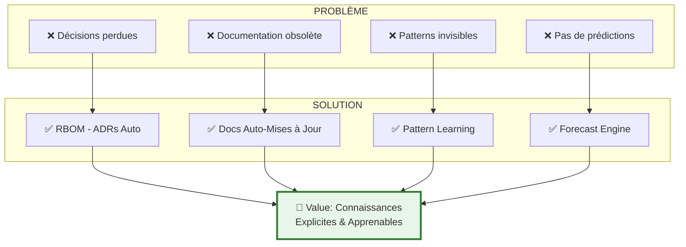
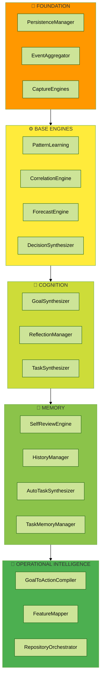
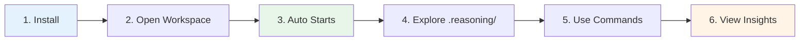

# 🗺️ Reasoning Layer V3 — Product Map Globale

**Version**: V1.0.85  
**Format**: Visual map pour Notion  
**Usage**: Page d'accueil / Overview du produit

---

## 🌍 Carte Globale Interactive



---

## 🎯 Zones du Produit

### Zone 1: Capture (Foundation)
```
┌─────────────────────────────────────┐
│  📸 CAPTURE AUTOMATIQUE             │
│                                     │
│  • Files            ✅              │
│  • Git Commits      ✅              │
│  • Dependencies     ✅              │
│  • Tests            ✅              │
│  • Config Files     ✅              │
│                                     │
│  Output: .reasoning/traces/        │
│  Status: 2,036 events capturés     │
└─────────────────────────────────────┘
```

### Zone 2: Cognition (Intelligence)
```
┌─────────────────────────────────────┐
│  🧠 TRAITEMENT COGNITIF             │
│                                     │
│  Pattern Learning    ✅ 4 patterns  │
│  Correlations        ✅ 597+        │
│  Forecasts          ✅ 4           │
│  ADR Generation     ✅ Auto        │
│                                     │
│  Output: patterns, correlations,   │
│          forecasts, adrs/          │
└─────────────────────────────────────┘
```

### Zone 3: Agent (External)
```
┌─────────────────────────────────────┐
│  🌍 AGENT GITHUB GLOBAL             │
│                                     │
│  Watching           ✅ Active       │
│  Scoring           ✅ 100% accuracy│
│  Commenting        ✅ Phase 4      │
│  Graph Building    ✅ 14 nodes     │
│                                     │
│  Status: Fully Operational         │
└─────────────────────────────────────┘
```

### Zone 4: Autonomy (Self-Improvement)
```
┌─────────────────────────────────────┐
│  🤖 AUTONOMIE COGNITIVE             │
│                                     │
│  Self-Observation   ✅              │
│  Self-Decision      ✅ 12 tasks    │
│  Self-Execution     ✅ 100% success│
│  Self-Improvement   ✅ Ongoing      │
│                                     │
│  Cycles: 4+ completed                │
└─────────────────────────────────────┘
```

---

## 🔄 Flow Complet du Système



---

## 📊 Métriques Live

> 💡 **État réel du système à l'instant T**





---

## 🎨 User Journeys

### Journey 1: Développeur Quotidien


### Journey 2: Utilisation Agent GitHub


---

## 🎯 Value Proposition Visual



---

## 🏆 Features Matrix

| Feature | Capture | Cognitive | Agent | Autonomy |
|---------|---------|-----------|-------|----------|
| **File Tracking** | ✅ | - | - | - |
| **Pattern Learning** | - | ✅ | - | - |
| **GitHub Observation** | - | - | ✅ | - |
| **Self-Improvement** | - | - | - | ✅ |
| **ADRs** | - | ✅ | - | - |
| **Forecasts** | - | ✅ | - | - |
| **Comments** | - | - | ✅ | - |
| **ODRR Cycles** | - | - | - | ✅ |

---

## 🎨 Diagramme d'Architecture Hiérarchique



---

## 🌟 Quick Start Visual



---

**Carte générée automatiquement**  
**Format**: Notion-compatible avec Mermaid  
**Version**: V1.0.85

